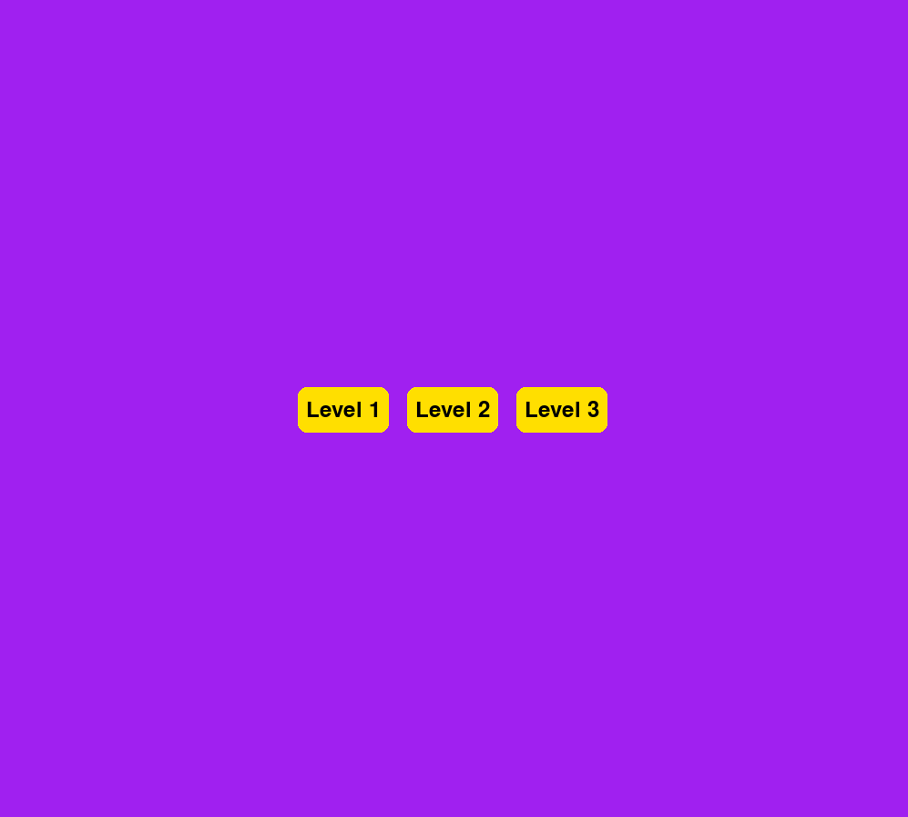
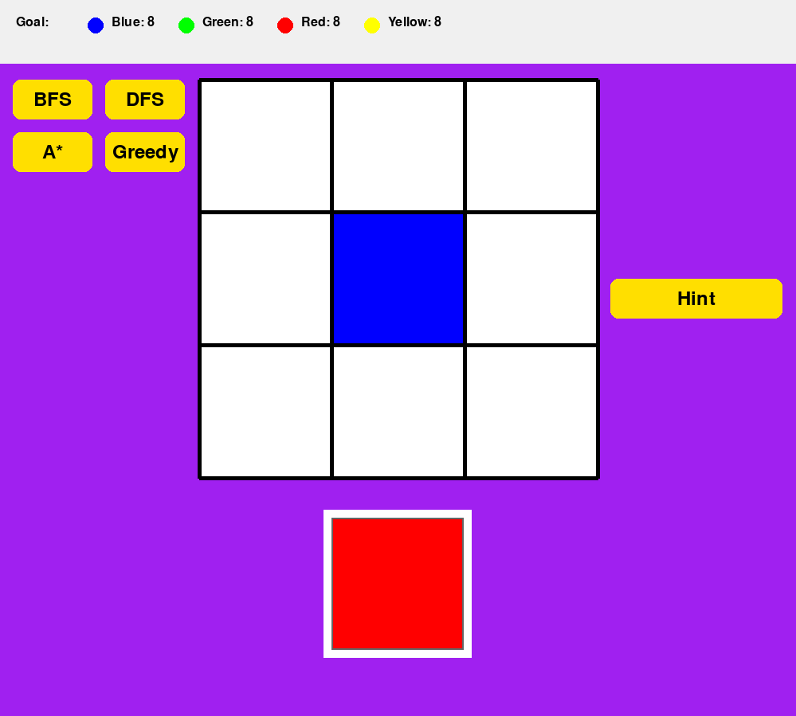
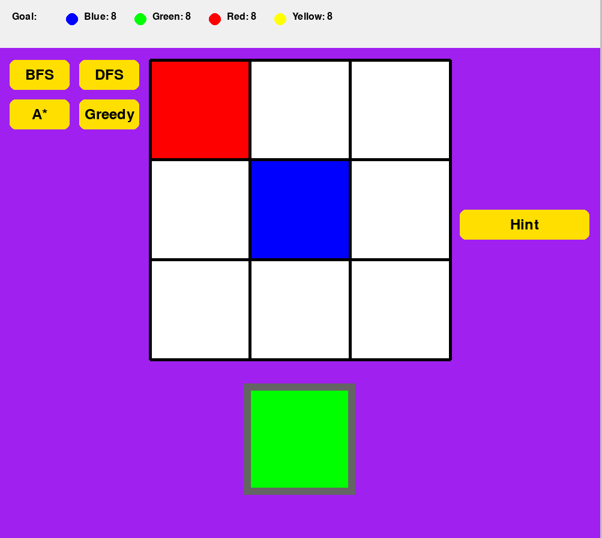
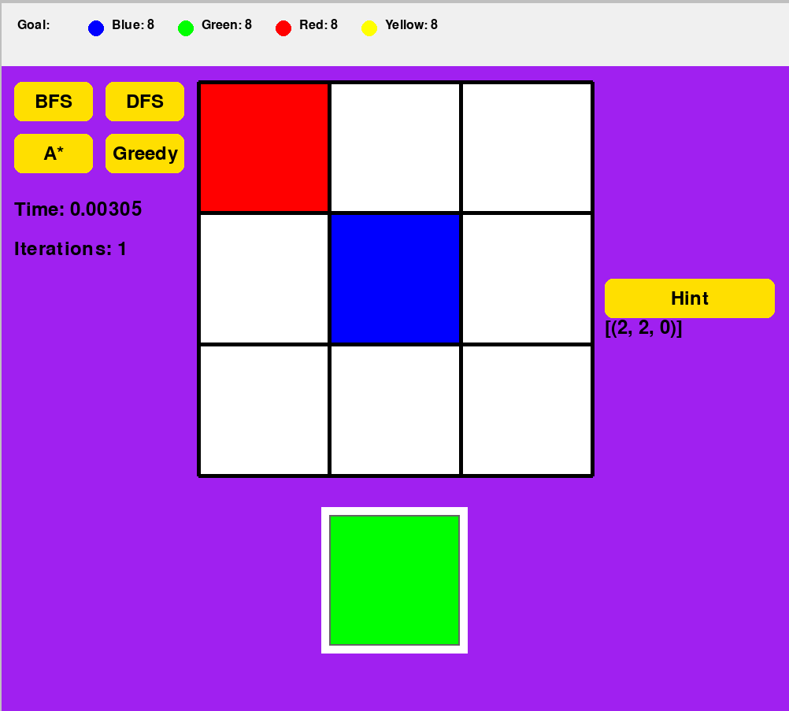
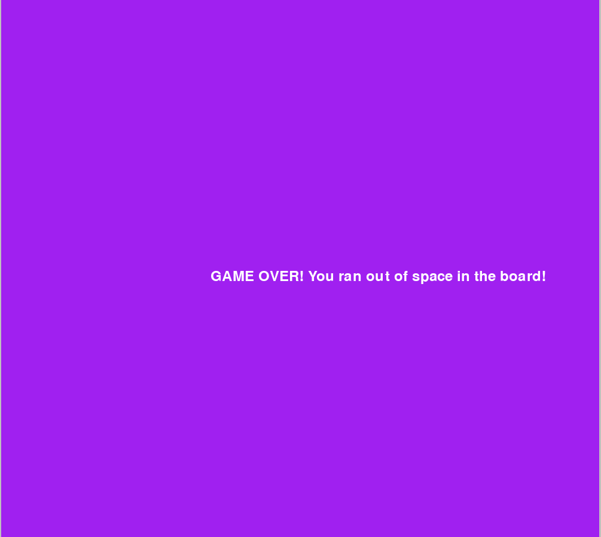

# IA-Jelly-Field-Puzzle

## Group A1 42

### How to run


```
pip install pygame
```

```
python -m venv venv

python3 -m venv venv
```

Windows
```
venv/Scripts/activate
```

Linux
```
source venv/bin/activate
```

```
python game.py

python3 game.py
```

### How to use

After running the window to play the game shall pop up and show 3 different levels to choose from



After choosing a level the window changes to the board of that level with the UI giving you the choice to run the different search algorithms, giving you the time and number of nodes explored. 



You can also choose to play the game simply by clicking the piece on your hand, it will change the border color to showcase when you have it selected, and then simply clicking anywhere on the board. In case of any illegal move, theres already a piece in the place trying to play or placing outside of game board the play will not go through and the piece will get deselected.



When in question on what move to make, the Hint button will recommend what play to make.



When the goal is achieved and all colors objectives are popped Victory is achieved, or in case of no more plays being possible because game board is full a Game Over screen is shown.





